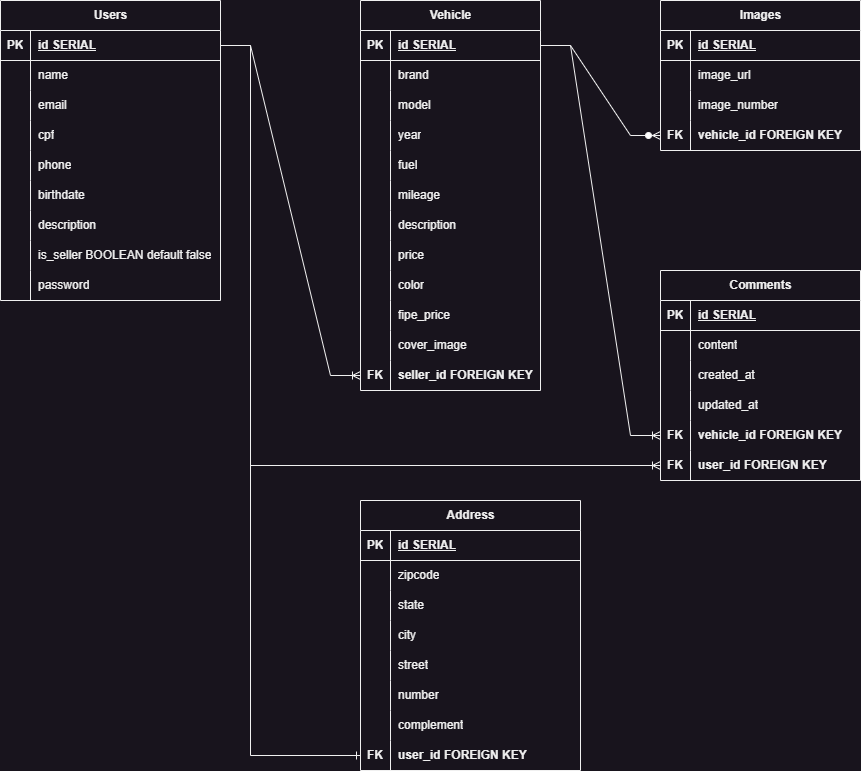

<h1 align="center">
  kenzie-kars-api
</h1>

 The Kenzie Kars API is the backend for the Kenzie Kars application. It has been developed using Node.js, Express, TypeORM, and PostgreSQL. This API provides a set of endpoints that allow you to perform various operations related to the Kenzie Kars application.

<h2 id="top">Table of Contents</h2>

<ol>
  <li><a href="#1-overview">Overview</a></li>
  <li><a href="#2-er-diagram">ER Diagram</a></li>
  <li><a href="#3-quick-start">Quick Start</a>
    <ol>
      <li><a href="#31-installing-dependencies">Installing Dependencies</a></li>
      <li><a href="#32-environment-variables">Environment Variables</a></li>
      <li><a href="#33-migrations">Migrations</a></li>
      <li><a href="#34-running-the-api">Running the API</a></li>
    </ol>
  </li>
  <li><a href="#4-api-documentation">API Documentation</a></li>
  <li><a href="#5-database-schema">Database Schema</a></li>
  <li><a href="#6-api-endpoints">API Endpoints</a></li>
</ol>

<h2 id="1-overview">Overview</h2>

  The project was developed entirely in TypeScript, using Node.js as the runtime environment, and Express as the chosen framework. Data serialization for requests was handled using the Zod library, while the PostgreSQL relational database was used for data storage, managed by TypeORM.

  Here are the links for more information about the technologies used:

<ul>
  <li><a href="https://nodejs.org/en/">Node.js</a></li>
  <li><a href="https://expressjs.com/">Express</a></li>
  <li><a href="https://www.typescriptlang.org/">TypeScript</a></li>
  <li><a href="https://www.postgresql.org/">PostgreSQL</a></li>
  <li><a href="https://typeorm.io/">TypeORM</a></li>
  <li><a href="https://zod.dev/">Zod</a></li>
</ul>

<h2 id="2-er-diagram">ER Diagram</h2>

  ER diagram of the API defining the relationships between database tables.

  

<h2 id="3-quick-start">Quick Start</h2>

<a href="#top">Back to Top</a>

<h3 id="31-installing-dependencies">3.1. Installing Dependencies</h3>

  Clone the project to your machine and install the dependencies using the command:

<pre><code>yarn
</code></pre>

  Using npm:

<pre><code>npm install
</code></pre>

<h3 id="32-environment-variables">3.2. Environment Variables</h3>

  Next, create a <strong>.env</strong> file by copying the format from the <strong>.env.example</strong> file:

<pre><code>cp .env.example .env</code></pre>

  Configure your environment variables with your Postgres credentials.

<h3 id="33-migrations">3.3. Migrations</h3>

  Run the migrations using the command:

<pre><code>yarn run typeorm migration:run -- -d ./src/data-source
</code></pre>

<h3 id="34-running-the-api">3.4. Running the API</h3>

  To run the API locally, use the command:

<pre><code>yarn run dev
</code></pre>

  Below are the commands for building the project:

<pre><code>yarn run build
yarn typeorm migration:run -d dist/data-source
yarn run start
</code></pre>

<h2 id="4-api-documentation">API Documentation</h2>

<a href="#top">Back to Top</a>

  You can access the API documentation created with Swagger using the endpoint <strong>/api-docs/</strong>. This documentation describes the resources that the API possesses, such as endpoints, request examples, response examples, and authentication methods.
  You can also access the API documentation through the following links:

<ul>
  <li><a href="https://kenzie-kars-nnt2.onrender.com/api-docs/">Kenzie-Kars-Production-Documentation</a></li>
  <li><a href="https://app.swaggerhub.com/apis-docs/EDUARDOSCHWERT/kenzie-kars-api/1.0.0">Kenzie-Kars-Swagger-Site-Documentation</a></li>
</ul>

  To import the workspace into Insomnia:

<h2 id="5-database-schema">Database Schema</h2>

<a href="#top">Back to Top</a>

<h3>Index</h3>

<ul>
  <li><a href="#1-users">Users</a></li>
  <li><a href="#2-address">Address</a></li>
  <li><a href="#3-vehicles">Vehicles</a></li>
  <li><a href="#4-images">Images</a></li>
</ul>

<h3 id="1-users">1. Users</h3>

The "User" object is defined as follows:

<table>
  <thead>
    <tr>
      <th>Field</th>
      <th>Type</th>
      <th>Description</th>
    </tr>
  </thead>
  <tbody>
    <tr>
      <td>id</td>
      <td>UUID</td>
      <td>Unique identifier for the user</td>
    </tr>
    <tr>
      <td>name</td>
      <td>string</td>
      <td>The name of the user</td>
    </tr>
    <tr>
      <td>email</td>
      <td>string</td>
      <td>The email address of the user</td>
    </tr>
    <tr>
      <td>password</td>
      <td>string</td>
      <td>The user's access password</td>
    </tr>
    <tr>
      <td>cpf</td>
      <td>string</td>
      <td>The CPF of the user</td>
    </tr>
    <tr>
      <td>phone</td>
      <td>string</td>
      <td>The phone number of the user</td>
    </tr>
    <tr>
      <td>birthdate</td>
      <td>Date</td>
      <td>The birthdate of the user</td>
    </tr>
    <tr>
      <td>description</td>
      <td>string</td>
      <td>The description of the user (optional)</td>
    </tr>
    <tr>
      <td>is_seller</td>
      <td>boolean</td>
      <td>Specifies if the user is a seller</td>
    </tr>
    <tr>
      <td>createdAt</td>
      <td>string</td>
      <td>The registration date of the user</td>
    </tr>
    <tr>
      <td>updatedAt</td>
      <td>string</td>
      <td>The date of the user's last update</td>
    </tr>
    <tr>
      <td>address</td>
      <td>Address</td>
      <td>The address of the user</td>
    </tr>
  </tbody>
</table>

<h3 id="2-address">2. Address</h3>

The "Address" object is defined as follows:

<table>
  <thead>
    <tr>
      <th>Field</th>
      <th>Type</th>
      <th>Description</th>
    </tr>
  </thead>
  <tbody>
    <tr>
      <td>cep</td>
      <td>string</td>
      <td>The ZIP code of the address</td>
    </tr>
    <tr>
      <td>state</td>
      <td>string</td>
      <td>The state of the address</td>
    </tr>
    <tr>
      <td>city</td>
      <td>string</td>
      <td>The city of the address</td>
    </tr>
    <tr>
      <td>street_number</td>
      <td>string</td>
      <td>The street number of the address</td>
    </tr>
    <tr>
      <td>complement</td>
      <td>string</td>
      <td>The complement of the address (optional)</td>
    </tr>
  </tbody>
</table>

<h3 id="3-vehicles">3. Vehicles</h3>

The "Vehicle" object is defined as follows:

<table>
  <thead>
    <tr>
      <th>Field</th>
      <th>Type</th>
      <th>Description</th>
    </tr>
  </thead>
  <tbody>
    <tr>
      <td>id</td>
      <td>UUID</td>
      <td>Unique identifier of the vehicle</td>
    </tr>
    <tr>
      <td>brand</td>
      <td>string</td>
      <td>The brand of the vehicle</td>
    </tr>
    <tr>
      <td>model</td>
      <td>string</td>
      <td>The model of the vehicle</td>
    </tr>
    <tr>
      <td>year</td>
      <td>string</td>
      <td>The manufacturing year of the vehicle</td>
    </tr>
    <tr>
    <tr>
      <td>fuel</td>
      <td>number</td>
      <td>The fuel type of the vehicle. It can be one of the following options:</td>
    </tr>
    <tr>
    <td colspan="3">
      <ul>
        <li>1: Flex</li>
        <li>2: Híbrido</li>
        <li>3: Elétrico</li>
      </ul>
    </td>
    </tr>
    <tr>
      <td>color</td>
      <td>string</td>
      <td>The color of the vehicle</td>
    </tr>
    <tr>
      <td>fipe_price</td>
      <td>number</td>
      <td>The FIPE price of the vehicle. It represents the market value of the vehicle based on official research.</td>
    </tr>
    <tr>
      <td>price</td>
      <td>number</td>
      <td>The price of the vehicle</td>
    </tr>
    <tr>
      <td>is_good_buy</td>
      <td>boolean</td>
      <td>Specifies whether the price of the vehicle is 5% below the FIPE price. It indicates if the vehicle is considered a good buy based on its price compared to the market value.</td>
    </tr>
    <tr>
      <td>is_active</td>
      <td>boolean</td>
      <td>Specifies whether the vehicle is active and visible to other users. If set to true, the vehicle is available for others to view and interact with. If set to false, the vehicle is inactive and not visible to other users.</td>
    </tr>
    <tr>
      <td>description</td>
      <td>string</td>
      <td>The description of the vehicle (optional)</td>
    </tr>
    <tr>
      <td>cover_image</td>
      <td>string</td>
      <td>The cover_image of the vehicle</td>
    </tr>
    <tr>
      <td>images</td>
      <td>Images</td>
      <td>The images of the vehicle (optional)</td>
    </tr>
    <tr>
      <td>createdAt</td>
      <td>string</td>
      <td>The vehicle's registration date</td>
    </tr>
    <tr>
      <td>updatedAt</td>
      <td>string</td>
      <td>The date of the vehicle's last update</td>
    </tr>
  </tbody>
</table>

<h3 id="4-images">4. Images</h3>

The "Image" object is defined as follows:

<table>
  <thead>
    <tr>
      <th>Field</th>
      <th>Type</th>
      <th>Description</th>
    </tr>
  </thead>
  <tbody>
    <tr>
      <td>id</td>
      <td>UUID</td>
      <td>Unique identifier of the image</td>
    </tr>
    <tr>
      <td>image_number</td>
      <td>integer</td>
      <td>The order number of the image</td>
    </tr>
    <tr>
      <td>image_url</td>
      <td>string</td>
      <td>The URL of the image</td>
    </tr>
    <tr>
      <td>createdAt</td>
      <td>string</td>
      <td>The image's registration date</td>
    </tr>
  </tbody>
</table>

<h2 id="6-api-endpoints">API Endpoints</h2>

<a href="#top">Back to top</a>

<h3>Index</h3>

<ul>
  <li><a href="#1-usersEndPoint">Users</a></li>
  <li><a href="#2-vehiclesEndPoint">Vehicles</a></li>
</ul>

<h3 id="1-usersEndPoint">Endpoints for users</h3>

<table>
  <thead>
    <tr>
      <th>Method</th>
      <th>Route</th>
      <th>Description</th>
    </tr>
  </thead>
  <tbody>
    <tr>
      <td>POST</td>
      <td>/users</td>
      <td>Create a user</td>
    </tr>
    <tr>
      <td>GET</td>
      <td>/users/</td>
      <td>Retrieve logged-in user data</td>
    </tr>
    <tr>
      <td>PATCH</td>
      <td>/users/</td>
      <td>Update user data</td>
    </tr>
    <tr>
      <td>PATCH</td>
      <td>/users/address</td>
      <td>Update the user's address</td>
    </tr>
    <tr>
      <td>DELETE</td>
      <td>/users/</td>
      <td>Delete a user</td>
    </tr>
    <tr>
      <td>GET</td>
      <td>/users/user_vehicles</td>
      <td>List vehicles of logged-in user</td>
    </tr>
    <tr>
      <td>POST</td>
      <td>/login</td>
      <td>Login with a user</td>
    </tr>
  </tbody>
</table>

<h3 id="2-vehiclesEndPoint">Endpoints for vehicles</h3>

<table>
  <thead>
    <tr>
      <th>Method</th>
      <th>Route</th>
      <th>Description</th>
    </tr>
  </thead>
  <tbody>
    <tr>
      <td>POST</td>
      <td>/vehicles</td>
      <td>Create a vehicle</td>
    </tr>
    <tr>
      <td>GET</td>
      <td>/vehicles/user/{userId}</td>
      <td>Retrieve a user's vehicles using their ID</td>
    </tr>
    <tr>
      <td>GET</td>
      <td>/vehicles/</td>
      <td>Retrieve all vehicles</td>
    </tr>
    <tr>
      <td>GET</td>
      <td>/vehicles/max</td>
      <td>Get the maximum price and mileage from the database</td>
    </tr>
    <tr>
      <td>PUT</td>
      <td>/vehicles/{vehicleId}</td>
      <td>Update a vehicle</td>
    </tr>
    <tr>
      <td>DELETE</td>
      <td>/vehicles/{vehicleId}</td>
      <td>Delete a vehicle</td>
    </tr>
  </tbody>
</table>

<h4>Author</h4>

  This project was developed by Eduardo, Juliana, Natalia, Douglas, Wesley.

